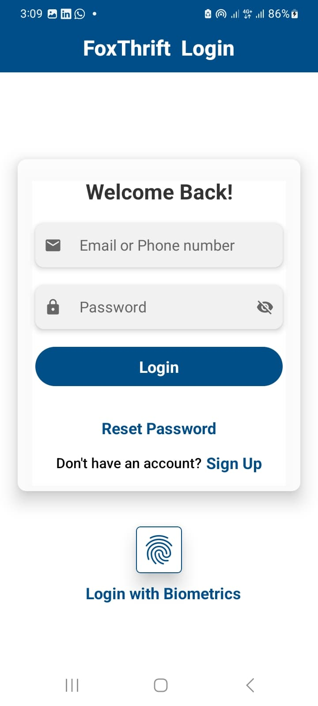
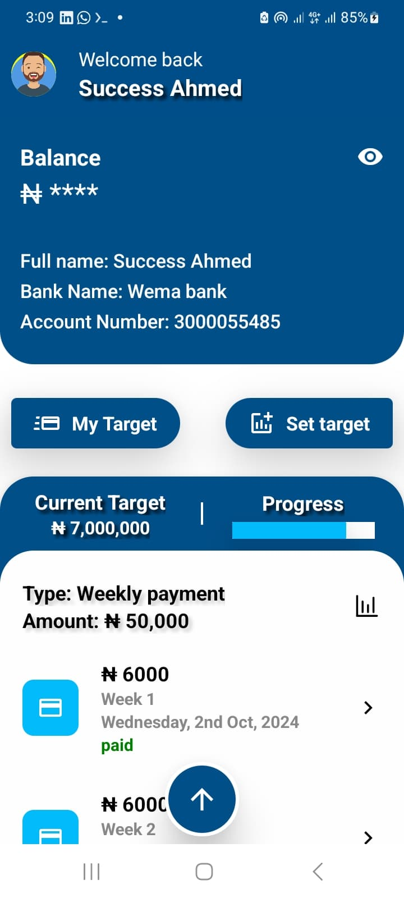

# 🦊 FoxThrift

FoxThrift is a modern React Native fintech mobile application designed to digitize the traditional savings culture commonly managed by market women using paper and pencil. This app offers a secure and intuitive platform for users to **save money**, **track contributions**, and **withdraw funds** at maturity — all in one place.

## 💰 Use case

- FoxThrift is tailored for small businesses, cooperatives, and individuals looking for an easy, paperless way to manage daily or periodic savings. It’s a modern alternative to the traditional “ajo” or “esusu” systems used in many African communities.

## ✨ Features

- 🔐 **Login & Logout** functionality
- 👆 **Biometric Authentication** (Fingerprint support)
- 💰 **Savings Management** (Create and track contributions)
- 📅 **Payment Tracking** (View saving dates, payment history, and withdrawal details)
- 📊 **Financial Insights** (Track progress towards goals)
- 📲 **Responsive Design** with intuitive UI

## 🔧 Tech Stack

- **React Native**
- **Expo SDK 53.0.0**
- **Secure Store** for authentication
- **Local Authentication** for biometric support
- **Axios** for API requests

<h3>📸 Screenshots</h3>

  

  

